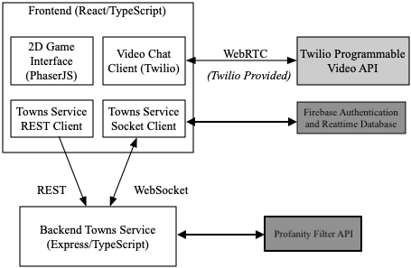
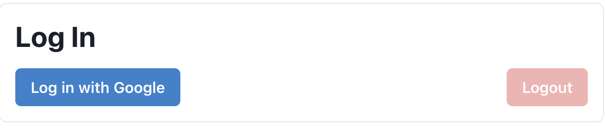
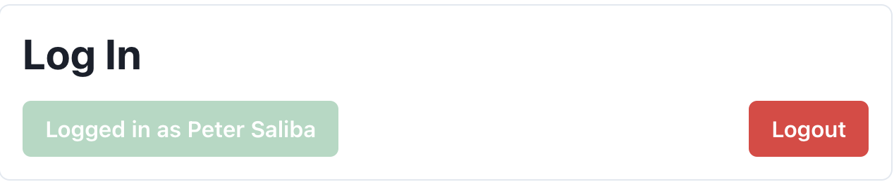
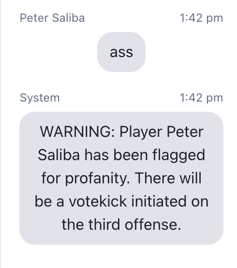
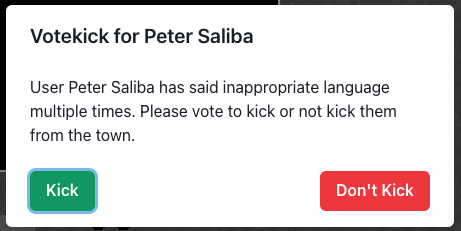

# Covey.Town With Vote Kick

Covey.Town provides a virtual meeting space where different groups of people can have simultaneous video calls, allowing participants to drift between different conversations, just like in real life.
Covey.Town was built for Northeastern's [Spring 2021 software engineering course](https://neu-se.github.io/CS4530-CS5500-Spring-2021/), and is designed to be reused across semesters.
You can view our reference deployment of the app at [app.covey.town](https://app.covey.town/), and this project's deployment of the app [here](https://covey-town-votekick-frontend.onrender.com/).

The figure above depicts the high-level architecture of Covey.Town.
The frontend client (in the `frontend` directory of this repository) uses the [PhaserJS Game Library](https://phaser.io) to create a 2D game interface, using tilemaps and sprites.
The frontend implements video chat using the [Twilio Programmable Video](https://www.twilio.com/docs/video) API, and that aspect of the interface relies heavily on [Twilio's React Starter App](https://github.com/twilio/twilio-video-app-react). Twilio's React Starter App is packaged and reused under the Apache License, 2.0.

A backend service (in the `townService` directory) implements the application logic: tracking which "towns" are available to be joined, and the state of each of those towns.

A user must be logged into a Google account in order to use Covey.Town. This authentication is done using Google Firebase, and user information is stored using Firebase's Realtime database. 

All chat messages sent in a town are checked for profanity using neutrinoapi's bad word filter, which can be found [here](https://www.neutrinoapi.com/api/bad-word-filter/). A user that repeatedly uses profanity in chat can be voted out of the town, or eventiaully kicked automaticlly. For more information, see [Kicking a player](#kicking-a-player).

## Running this app locally

Running the application locally entails running both the backend service and a frontend.

### Setting up the backend

To run the backend, you will need a Twilio account and a neutrino account. Twilio provides new accounts with $15 of credit, which is more than enough to get started. Neutrino is a free service that does not require an email to sign up which checks chat messages for profanity. 
To create an account and configure your local environment:

1. Go to [Twilio](https://www.twilio.com/) and create an account. You do not need to provide a credit card to create a trial account.
2. Create an API key and secret (select "API Keys" on the left under "Settings")
3. Go to [neutrino](https://www.neutrinoapi.com/signup/) and sign up for an account. 
4. Create an API key by clicking "My Account" and then "Add API Key". 
5. Create a `.env` file in the `townService` directory, setting the values as follows:

| Config Value            | Description                               |
| ----------------------- | ----------------------------------------- |
| `TWILIO_ACCOUNT_SID`    | Visible on your twilio account dashboard. |
| `TWILIO_API_KEY_SID`    | The SID of the new API key you created.   |
| `TWILIO_API_KEY_SECRET` | The secret for the API key you created.   |
| `TWILIO_API_AUTH_TOKEN` | Visible on your twilio account dashboard. |
| `PROFANITY_API_USERNAME`| Visible on your neutrino My Account dashboard. |
| `PROFANITY_API_TOKEN`   | The secret for the neutrino API key your created. |

### Starting the backend

Once your backend is configured, you can start it by running `npm start` in the `townService` directory (the first time you run it, you will also need to run `npm install`).
The backend will automatically restart if you change any of the files in the `townService/src` directory.

### Configuring the frontend

Create a `.env` file in the `frontend` directory, with the line: `NEXT_PUBLIC_TOWNS_SERVICE_URL=http://localhost:8081` (if you deploy the towns service to another location, put that location here instead)

For ease of debugging, you might also set the environmental variable `NEXT_PUBLIC_TOWN_DEV_MODE=true`. When set to `true`, the frontend will
automatically connect to the town with the friendly name "DEBUG_TOWN" (creating one if needed), and will *not* try to connect to the Twilio API. This is useful if you want to quickly test changes to the frontend (reloading the page and re-acquiring video devices can be much slower than re-loading without Twilio).

### Running the frontend

In the `frontend` directory, run `npm run dev` (again, you'll need to run `npm install` the very first time). After several moments (or minutes, depending on the speed of your machine), a browser will open with the frontend running locally.
The frontend will automatically re-compile and reload in your browser if you change any files in the `frontend/src` directory.

## How to use our changes 
A user must now log in with a Google account in order to use Covey.Town. If a user is kicked from a town, that google account is banned from joining any town, forever. 

### Signing Up and Logging In
To sign in to Covey.Town, click the blue 'Log in with Google' button on the town selection page. Once signed in, the button will change to display the username of the logged in account. To logout, simply click on the red 'Logout' button. A user will not be able to create or join any town if they are not logged in. Below is a screenshot with a user that has not logged in:

Once a user has logged in:

### Kicking a player
Each chat message sent by a user is checked for profanity using neutrino's filter API. If a user is flagged for using bad word, a warning is sent in chat to all users.

If the player is flagged for using profanity for a third time, a vote kick will be initiated. All other players in the town have the ability to vote the offending player out of the town. If a majority of players vote to remove the player, the user will be kicked from the town and be banned from joining any Covey.Town town again. 

If a player is not removed as a result of the vote, they stay in the game. However, if they use profanity in chat 3 more times, they will be automatically kicked and banned from rejoining any town. They will not be able to use their google account to join any town in the future. 